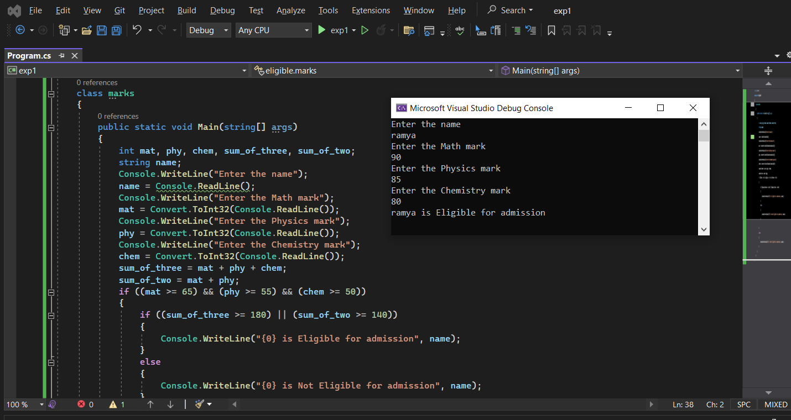
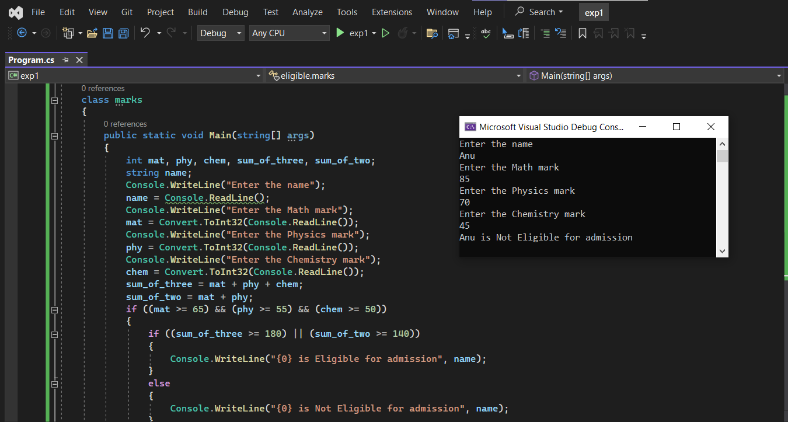

## Eligibility-for-Admission

### Aim:
To write C# program to find the eligibility for admission to an engineering course

### Algorithnm:
#### Step1:
Start by creating a new class.

#### Step2:
Initiate the integer variables to assign the marks of Maths, Physics and Chemistry and a string variable to assign the name of the student; read the input from the user.

#### Step3:
Calculate the first total that sums all the 3 subject marks; and the second total that sums maths and physics marks.

#### Step4:
Based on the condition given, check whether the student is eligible for the engineering admission.

#### Step5:
Display the output for the input read from the user.

#### Step6:
Stop the execution.

### Program:
Program developed by : S Praneet

Register number : 212221230078
~~~~
using System;
namespace eligible
{
    class marks
    {
        public static void Main(string[] args)
        {
            int mat, phy, chem, sum_of_three, sum_of_two;
            string name;
            Console.WriteLine("Enter the name");
            name = Console.ReadLine();
            Console.WriteLine("Enter the Math mark");
            mat = Convert.ToInt32(Console.ReadLine());
            Console.WriteLine("Enter the Physics mark");
            phy = Convert.ToInt32(Console.ReadLine());
            Console.WriteLine("Enter the Chemistry mark");
            chem = Convert.ToInt32(Console.ReadLine());
            sum_of_three = mat + phy + chem;
            sum_of_two = mat + phy;
            if ((mat >= 65) && (phy >= 55) && (chem >= 50))
            {
                if ((sum_of_three >= 180) || (sum_of_two >= 140))
                {
                    Console.WriteLine("{0} is Eligible for admission", name);
                }
                else
                {
                    Console.WriteLine("{0} is Not Eligible for admission", name);
                }

            }
            else
            {
                Console.WriteLine("{0} is Not Eligible for admission", name);
            }
        }
    }
}
~~~~
### Output:

### Result:
Thus, a C# program to check the eligibility of a student on engineering admission has been executed successfully.
